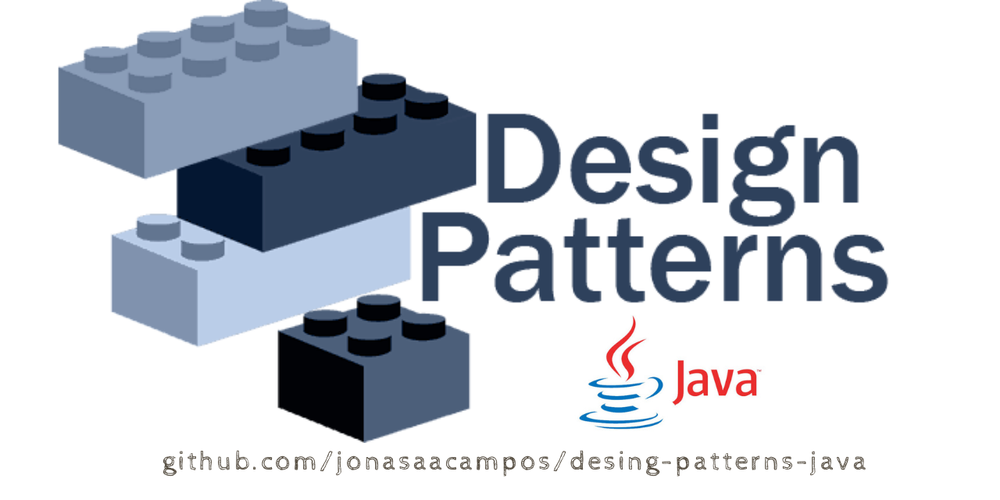
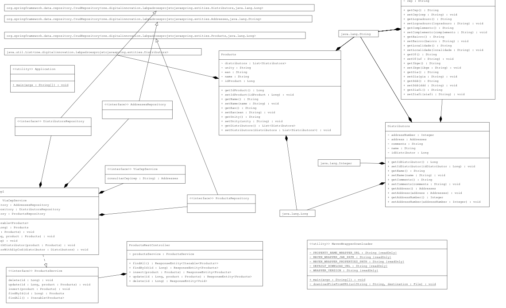

# Explorando Padrões de Projetos na Prática com Java

<p align="center">
	  
</p>


<p align="center">
  <a href="https://github.com/jonasaacampos/desing-patterns-java">
     
  </a>
</p>

<hr/>

Para iniciar este projeto, foi utilizado o [spring initializr](https://start.spring.io/) utilizando as opções:
* Project: Maven Project;
* Language: Java 11;
* Spring Boot: 2.6.0;
* Dependencies: Spring Web, Spring Data JPA, H2 Database e OpenFeign.

Dependência adicionada manualmente no `pom.xml`: [Springdoc OpenAPI UI v1.5.12](https://mvnrepository.com/artifact/org.springdoc/springdoc-openapi-ui/1.5.12).

## Diagrama do código (UML Diagram)
<p align="center">
  <a href="https://github.com/jonasaacampos/desing-patterns-java">
     
  </a>
</p>


<hr/>

## Padrões de projeto analisados
- [ ] Singleton
- [ ] Strategy
- [ ] Facade


## Singleton

Torne a classe do objeto de instância única responsável pela criação, inicialização, acesso e aplicação. Declare a instância como um membro de dados estáticos privados. Forneça uma função de membro estático público que encapsula todo o código de inicialização e fornece acesso à instância.

O cliente chama a função de acesso (usando o nome da classe e o operador de resolução de escopo) sempre que uma referência à instância única for necessária.

### Exemplo


<p align="center">
  
</p>


<blockquote>
O padrão Singleton garante que uma classe tenha apenas uma instância e fornece um ponto global de acesso a essa instância. Ele é nomeado após o conjunto singleton, que é definido como um conjunto contendo um elemento. O escritório do presidente dos Estados Unidos é um Singleton. A Constituição dos Estados Unidos especifica os meios pelos quais um presidente é eleito, limita o mandato e define a ordem de sucessão. Como resultado, pode haver no máximo um presidente ativo por vez. Independentemente da identidade pessoal do presidente ativo, o título "O Presidente dos Estados Unidos" é um ponto de acesso global que identifica a pessoa no cargo.
</blockquote>

*Font:* [Singleton Design Pattern](https://sourcemaking.com/design_patterns/singleton)


## Strategy
Padrão Comportamental com objetivo de simplificar a variação de algoritmos para a resolução de um mesmo problema

A entidade Interface pode representar uma classe base abstrata ou as expectativas de assinatura do método pelo cliente. No primeiro caso, a hierarquia de herança representa polimorfismo dinâmico. No último caso, a entidade Interface representa o código do modelo no cliente e a hierarquia de herança representa o polimorfismo estático.

### Exemplo

<p align="center">
  
</p>

<blockquote>
Uma Estratégia define um conjunto de algoritmos que podem ser usados ​​alternadamente. Meios de transporte para um aeroporto é um exemplo de Estratégia. Existem várias opções, como dirigir o próprio carro, pegar um táxi, um ônibus para o aeroporto, um ônibus urbano ou um serviço de limusine. Para alguns aeroportos, metrôs e helicópteros também estão disponíveis como meio de transporte para o aeroporto. Qualquer um desses meios de transporte levará o viajante ao aeroporto e pode ser usado de forma intercambiável. O viajante deve escolher a Estratégia com base em trade-offs entre custo, conveniência e tempo.
</blockquote>

*Fonte:* [Strategy Design Pattern](https://sourcemaking.com/design_patterns/strategy)

  
## Facade ("Fachada")

Padrão Estrutural que visa prover uma interface que reduza a complexidade nas integrações com subsistemas. 

Facade discute o encapsulamento de um subsistema complexo em um único objeto de interface. Isso reduz a curva de aprendizado necessária para alavancar com êxito o subsistema. Também promove a dissociação do subsistema de seus potencialmente muitos clientes. Por outro lado, se a Fachada for o único ponto de acesso para o subsistema, isso limitará os recursos e a flexibilidade de que os "usuários avançados" podem precisar.

O objeto Fachada deve ser um defensor ou facilitador bastante simples. Não deve se tornar um oráculo onisciente ou objeto "deus".

### Exemplo

<p align="center">
  
</p>

<blockquote>
A Fachada define uma interface unificada de nível superior para um subsistema que facilita o uso. Os consumidores encontram uma fachada ao fazer pedidos de um catálogo. O consumidor liga para um número e fala com um representante de atendimento ao cliente. O representante de atendimento ao cliente atua como uma fachada, fornecendo uma interface para o departamento de atendimento de pedidos, o departamento de cobrança e o departamento de expedição.
</blockquote>

*Fonte:* [Facade Design Pattern - SourceMaking](https://sourcemaking.com/design_patterns/facade)


A relação entre Padrões de Projetos com Java e o spring framework pode-se ser percebida em:
* Annotations *@Bean* e *@Autowired* como padrão criacional **Singleton**;
* Annotations *@Service* e *@Repository* como padrão comportamental **Strategy**;
* Annotation *@RestController* como padrão estrutural **Facade**.

<hr>

Swagger: ``http://127.0.0.1:8080/swagger-ui.html``

Minimun Payload in POST: 
```JSON
{
  "name": "string",
  "ean": "string",
  "unity": "string",
  "distributors": [
    {
      "name": "string",
      "comments": "string",
      "address": {
        "cep": "stringCepWith8Numbers"
      },
	  "addressNumber": 1
    }
  ]
}
```
Example:
```JSON
{
  "name": "Caneta Esferográfica",
  "ean": "0058771387587",
  "unity": "Peça",
  "distributors": [
    {
      "name": "BIC",
      "comments": "Fabricante de canetas",
      "address": {
        "cep": "06447130"
      },
      "addressNumber": 800
    }
  ]
}
```

-----------
## Licença de utilização

<a rel="license" href="http://creativecommons.org/licenses/by/4.0/">
  
</a>
<br/>
This work is licensed under a <a rel="license" href="http://creativecommons.org/licenses/by/4.0/">Creative Commons Attribution 4.0 International License</a>.

<!-- CONTACT -->
## Contato

<p align='center'>

  <a href='https://github.com/jonasaacampos'>
    
  </a>

  <a href='https://www.linkedin.com/in/jonasaacampos/'>
    
  </a>

  <a href='https://www.facebook.com/jonasaacampos'>
    
  </a>

</p>

**Author:** Jonas Araujo de Avila Campos

**Confira mais projetos: [AQUI](https://jonasaacampos.github.io/portifolio/)**
